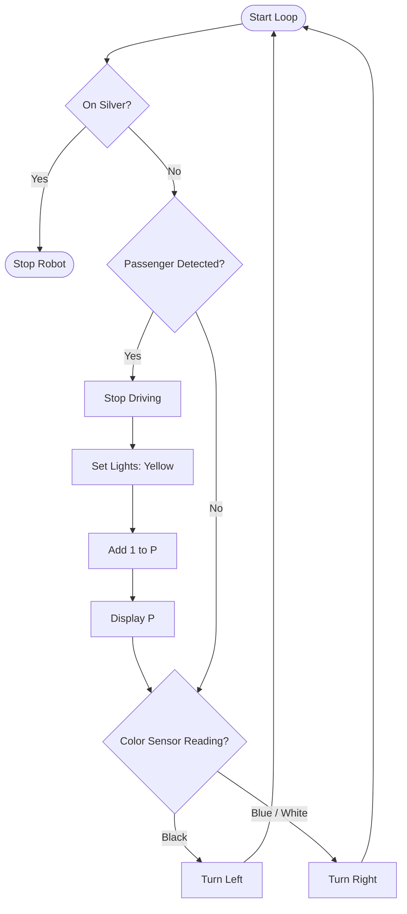

The challenge was to create a line-following robot that follows a white line and stays on the line even through tight turns. I worked on this project for about 1 day. During that time, I learned the basic concepts required to code autonomous robotic behaviors and designed a flowchart to plan out my logic.

## Programming Logic & Flowchart

To stay on the line, I had to find the **threshold** (average) between blue and black so the robot acknowledges the lowest off-track and the lowest on-track values. Then, I programmed the light sensor to use this threshold.

We programmed the bot to turn left if it sees black, and turn right if it sees blue or white. 
Next, I added logic to detect passengers on the left side. After detecting a passenger, the robot stops, changes its lights to yellow, adds 1 to a variable called `P`, and displays `P` on the screen. The final challenge was to stop completely when the robot detects the color silver.

Here is the flowchart I designed to plan out the robot's decision loop:

## Mechanical Issues

**Problem**: I initially mounted my color detector too far from the center of the robot. This caused the robot to miscalculate its position and think that it was somewhere it wasn't.

**Solution**: I redesigned the mounting bracket to bring the color detector back closer to the center axle where it originally was. This solved the geometry mismatch and allowed the robot to track the line perfectly.
